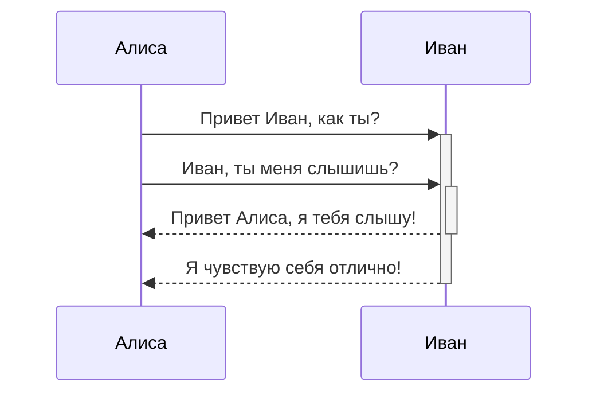

##### Привет 
Это мой обсидиан, я хочу вести свои заметки и научиться структурировать информацию правильно.

**Было бы супер внедрить:**
- Чтение
- Обучение
- Конспектирование
- Обработку информации
- Грамотные связи в программе
````

````

